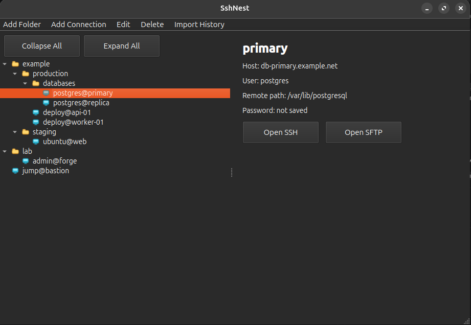

# SshNest

SshNest is a small native Linux GUI for opening saved SSH and SFTP connections.

## Screenshot



## Features

- Folder tree for organizing hosts
- Add, edit, and delete folders or connections
- First-run import from shell history
- SSH opens in a new Tilix window when Tilix is installed
- SFTP opens in the system file manager through `gio open` or `xdg-open`
- Configuration is saved in `~/.config/sshnest/config.json`

## Development

Use a virtual environment. Do not install Python dependencies into the OS Python.

```bash
./scripts/dev_setup.sh
./scripts/run.sh
```

For screenshots or demos, copy the sample config into place:

```bash
mkdir -p ~/.config/sshnest
cp samples/screenshot_config.json ~/.config/sshnest/config.json
```

## Build

```bash
./scripts/build_pyinstaller.sh
```

The PyInstaller binary will be created at:

```text
dist/SshNest/SshNest
```

For a one-file Linux app, package the PyInstaller output as an AppImage. The
preferred path is `linuxdeploy` or `appimagetool`, because AppImage gives a
single runnable file without requiring Python or PySide6 to be installed on the
target system.

External system commands are still expected on the target machine:

- `ssh`
- `tilix` for the preferred SSH terminal behavior
- `gio` or `xdg-open` for SFTP file-manager opening
